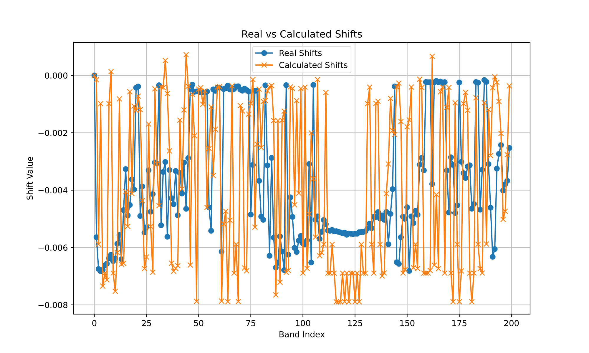

# Keystone Correction Algorithm

This project implements an algorithm to correct keystone distortion in hyperspectral images. The algorithm estimates and applies the necessary shifts to align adjacent spectral bands accurately.

## How It Works

The algorithm uses a combination of phase correlation and SIFT (Scale-Invariant Feature Transform) methods to estimate the keystone shift between adjacent bands. It then refines this estimate using a recursive coarse bisection method to achieve precise alignment.

### Key Steps:
1. **Initial Guess**: An initial estimate of the keystone shift is made using phase correlation and, if necessary, refined with SIFT.
2. **Refinement**: The initial guess is refined using a recursive coarse bisection method to minimize the phase shift between bands.
3. **Application**: The final estimated shift is applied to correct the keystone distortion for each band.

## How to Use

### Prerequisites
Ensure you have the required Python libraries installed:
- `numpy`
- `scipy`
- `opencv-python`
- `matplotlib`
- `scikit-learn`

### Main Function

To correct a keystone-distorted datacube, use the `main()` function:

```python
corrected_datacube = main(radianceData, adjustment=0.0001, threshold=0.005, max_iteration=500, first_guess_threshold=0.006)
```

## Testing

1. **Generate Distorted Datacube**: Apply keystone distortion to the datacube:
    ```python
    distorted_datacube = apply_keystone_to_datacube(corrected_datacube, start_shift=-0.01, end_shift=0.01)
    ```

2. **Evaluate Correction and Plot Results**: Test the keystone correction algorithm:
    ```python
    test(distorted_datacube, radianceData) 
    ```

This will display error metrics and save the plot as a PDF for review.


## Results

The algorithm was tested by applying a synthetic keystone distortion to a hyperspectral datacube. This distortion was simulated by applying keystone shifts ranging from -0.01 to 0.01 across the spectral bands.

### Error Metrics

The accuracy of the algorithm was evaluated using the following error metrics:

- **Mean Absolute Error (MAE)**: 0.002789
- **Root Mean Square Error (RMSE)**: 0.003443

These metrics quantify the discrepancy between the real keystone shifts applied and the shifts calculated by the algorithm.

### Shift Comparison

The plot below illustrates the comparison between the real keystone shifts and the shifts calculated by the algorithm. It shows how closely the calculated shifts align with the true values across the range of spectral bands.



## Citation

This algorithm is based on the work of Rogaß, Christian, Brell, Max, Segl, Karl, Kuester, Theres, and Kaufmann, Hermann. (2013). "Automatic Reduction of Keystone – Applications to EnMAP." We thank them for their contributions to the development of keystone correction techniques. 
